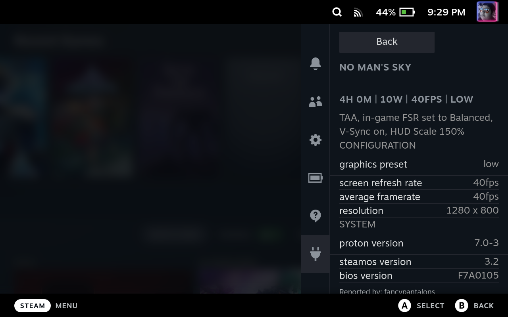
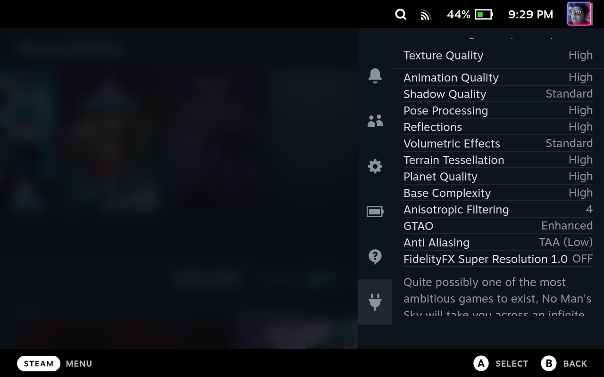
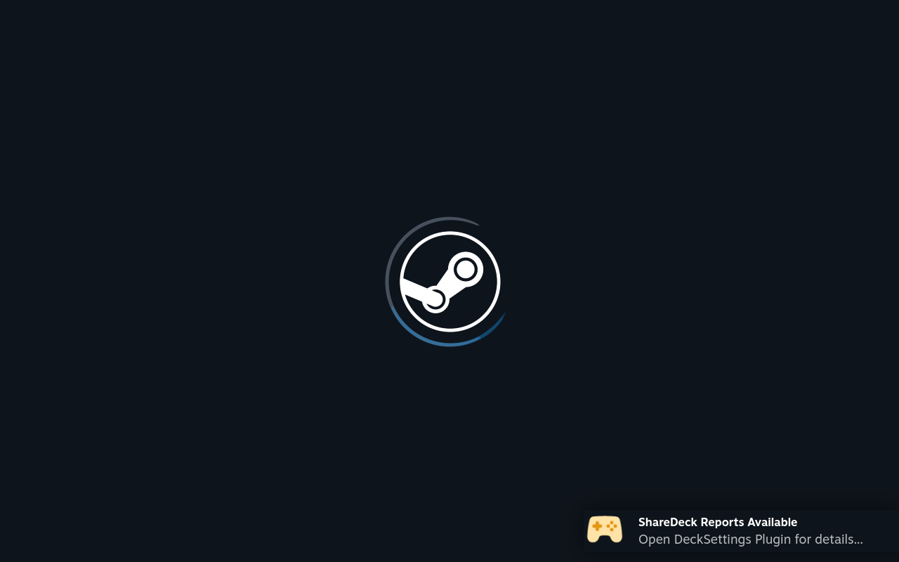
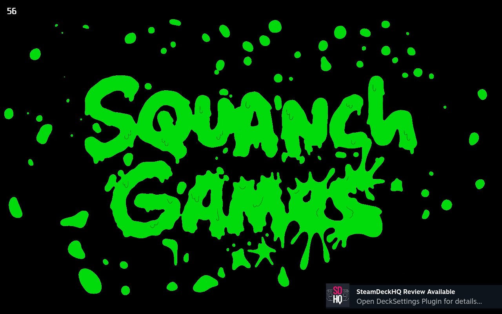
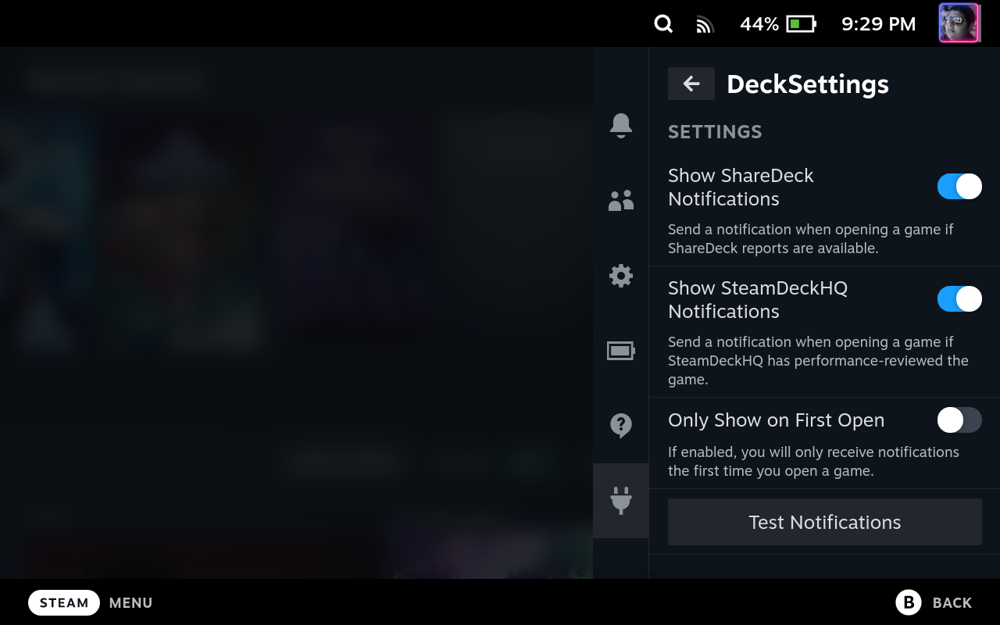

# DeckSettingsEX

## Description

A Decky Plugin for browsing recommended Steam Deck game settings from [ShareDeck](https://sharedeck.games) and [SteamDeckHQ](https://steamdeckhq.com/)

This is a fork of @davocarli's [DeckSettings](https://github.com/davocarli/sharedeck-y) plugin with updates to support the latest versions of Decky.

Allows you to see the recommended settings, and supports sending notifications when you open a game that has reported settings.

Built with [Decky Plugin Loader](https://github.com/SteamDeckHomebrew/PluginLoader).

## Current Features

DeckSettingsEX currently supports browsing reports for any steam games in your Steam Library.

### Game/Report Selection

Games List             |  Reports List
:-------------------------:|:-------------------------:
  |  

### View Reports/Settings

ShareDeck             |  SteamDeckHQ
:-------------------------:|:-------------------------:
  |  

### Notifications

ShareDeck             |  SteamDeckHQ
:-------------------------:|:-------------------------:
  |  

### Settings

## Planned Features

-   Search for games outside your library.
-   Partial Support for non-steam games (search for closest match).
-   Full Support for non-steam games (to be added when support comes to ShareDeck).
-   Submit ShareDeck reports from the plugin.
-   Auto-detect current settings when submitting a report from the plugin.
