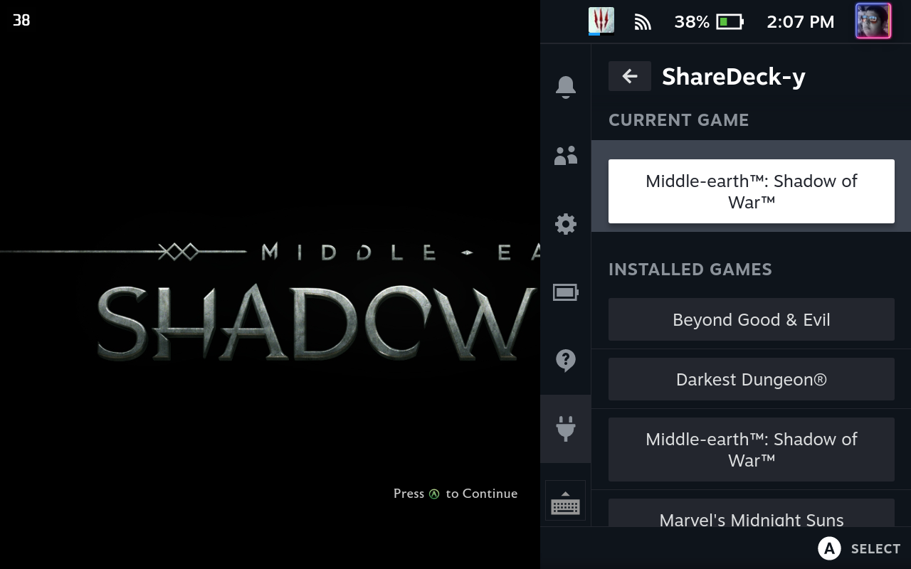
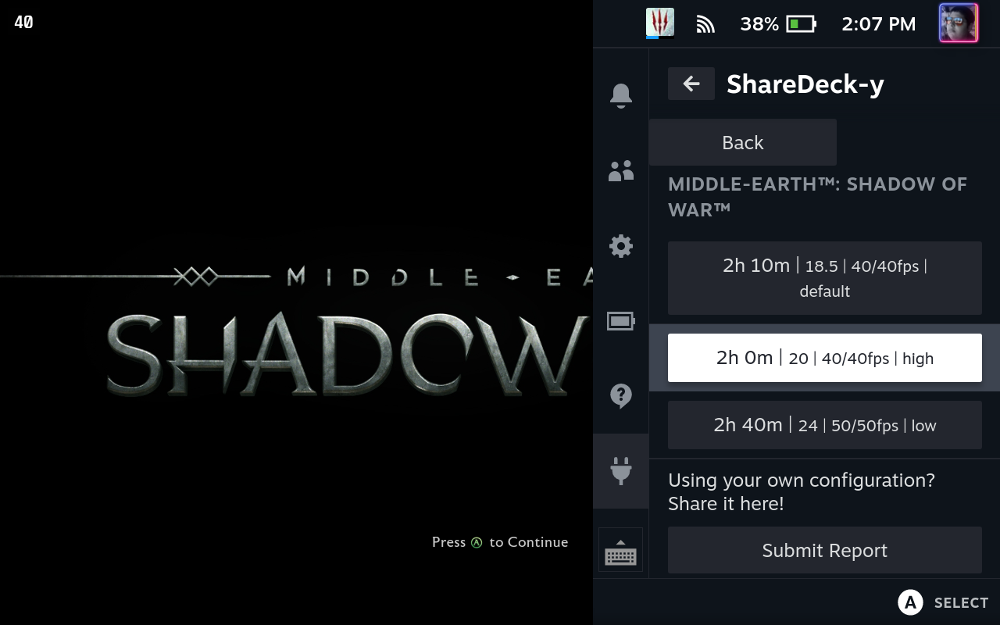

# ShareDeck-y

## Description

A Decky Plugin for browsing Game Settings reports submitted to [ShareDeck](https://sharedeck.games).

Build with [Decky Plugin Loader](https://github.com/SteamDeckHomebrew/PluginLoader).

## Current Features

ShareDeck-y currently supports browsing reports for any steam games in your Steam Library.

### Game Selection

### Report Selection

### Report View

## Planned Features

-   Search for games outside your library.
-   Partial Support for non-steam games (search for closest match).
-   Full Support for non-steam games (to be added when support comes to ShareDeck).
-   Submit reports from the plugin.
-   Auto-detect current settings when submitting a report from the plugin.
